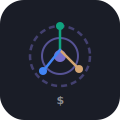

<p align="center">
  
</p>

<h1 align="center">TokenLens</h1>

<p align="center">
  <strong>Finally see where your AI budget is going.</strong>
</p>

<p align="center">
  Beautiful, open-source dashboard for AI API spending.<br />
  OpenAI · Anthropic · Google — all in one view.
</p>

<p align="center">
  <a href="#quick-start">Quick Start</a> •
  <a href="#why-tokenlens">Why?</a> •
  <a href="#features">Features</a> •
  <a href="#import-your-data">Import Your Data</a> •
  <a href="#contributing">Contributing</a>
</p>

<p align="center">
  <a href="https://github.com/zzzzico12/tokenlens/releases"></a>
  <a href="https://github.com/zzzzico12/tokenlens/blob/main/LICENSE"></a>
  <a href="https://github.com/zzzzico12/tokenlens/stargazers"></a>
</p>

---

## The problem

You're shipping AI features. The API bills are climbing. But when someone asks "where is the money going?", you open five different provider dashboards, squint at tables of numbers, and try to piece together the story.

> **CFO:** "Our AI API costs tripled this month. What happened?"
>
> **You:** _opens OpenAI dashboard, then Anthropic console, then AWS Billing..._ "Give me an hour."

**TokenLens gives you one beautiful dashboard for all your AI spending. Export a CSV from your provider, drop it in, and see everything instantly.**

## Why TokenLens

| | TokenLens | Langfuse | LiteLLM | Helicone | Braintrust |
|---|:---:|:---:|:---:|:---:|:---:|
| **No code changes** | ✅ | ❌ (SDK) | ❌ (proxy) | ❌ (proxy) | ❌ (SDK) |
| **No proxy needed** | ✅ | ✅ | ❌ | ❌ | ✅ |
| **Beautiful cost dashboard** | ✅ | partial | basic | ✅ | ✅ |
| **Treemap / Heatmap** | ✅ | ❌ | ❌ | ❌ | ❌ |
| **Multi-provider unified** | ✅ | ✅ | ✅ | partial | partial |
| **Self-hosted / offline** | ✅ | ✅ | ✅ | ❌ | ❌ |
| **Open source** | ✅ | ✅ | ✅ | partial | ❌ |
| **Setup time** | 2 min | 30 min+ | 30 min+ | 10 min | 30 min+ |

## Quick Start

```bash
git clone https://github.com/zzzzico12/tokenlens.git
cd tokenlens
npm install
npm run dev
```

Open `http://localhost:5173`, click **Import CSV**, and see your dashboard.

### Docker

```bash
docker run -p 3000:3000 ghcr.io/zzzzico12/tokenlens:latest
```

## Import Your Data

TokenLens reads CSV exports from your provider's dashboard. No API keys required.

### OpenAI

1. Go to **platform.openai.com → Usage → Export**
2. Download the CSV (`completions_usage_*.csv`)
3. Drop it anywhere on the TokenLens dashboard

### Anthropic

1. Go to **console.anthropic.com → Usage → Export**
2. Download the CSV (`claude_api_cost_*.csv`)
3. Drop it anywhere on the TokenLens dashboard

### Other providers

Any CSV with `date`, `model`, and `cost` columns will be auto-detected and imported.

> **All data stays in your browser.** Nothing is sent to any server.

## Features

### 📊 Cost Treemap

See exactly where every dollar goes. Models are nested inside providers, sized by spend. GPT-4o taking 60% of your budget? You'll see it immediately.

### 🔥 Daily Heatmap

GitHub-contribution-style heatmap showing daily spend. Spot spending spikes instantly.

### 📈 Trend Charts

Daily, weekly, and monthly cost trends with provider/model breakdown. Compare periods to see if costs are growing, shrinking, or staying flat.

### ⚠️ Budget Alerts

Set a monthly budget. TokenLens shows a burn-rate indicator and estimates when you'll hit the limit.

### 🌙 Dark Mode

Because you'll be staring at this dashboard at midnight when the alerts fire.

## Supported Providers

| Provider | CSV Import |
|---|:---:|
| OpenAI (`completions_usage_*.csv`) | ✅ |
| Anthropic (`claude_api_cost_*.csv`) | ✅ |
| Any CSV with date + model + cost | ✅ |

## Tech Stack

| Layer | Choice | Why |
|---|---|---|
| Framework | React + TypeScript | Component-based, strong ecosystem |
| Charts | Recharts + D3 | Treemap, Heatmap, Line charts |
| State | Zustand | Lightweight, no boilerplate |
| Build | Vite | Fast HMR, optimized builds |
| Styling | Tailwind CSS | Utility-first, dark mode built-in |

## Architecture

```
┌──────────────────────────────────────────────────┐
│                  Your Browser                     │
│                                                  │
│  ┌──────────────────────────────────────────┐    │
│  │         CSV Import                        │    │
│  │  Drag & drop or file picker               │    │
│  │  OpenAI · Anthropic · Generic             │    │
│  └────────────────────┬─────────────────────┘    │
│                       │                          │
│                       ▼                          │
│  ┌──────────────────────────────────────────┐    │
│  │         TokenLens Data Layer              │    │
│  │  Parse → Normalize → Aggregate            │    │
│  └────────────────────┬─────────────────────┘    │
│                       │                          │
│                       ▼                          │
│  ┌──────────────────────────────────────────┐    │
│  │         TokenLens Dashboard               │    │
│  │  Treemap · Heatmap · Trends · Budget      │    │
│  └──────────────────────────────────────────┘    │
│                                                  │
│  💾 All data stays in your browser               │
└──────────────────────────────────────────────────┘
```

**Zero backend. Zero data transmission. Everything runs in your browser.**

## Project Structure

```
tokenlens/
├── src/
│   ├── components/
│   │   ├── Dashboard/       # Metric cards
│   │   ├── Charts/          # Treemap, Heatmap, Trends
│   │   ├── Providers/       # CSV import modal
│   │   └── Budget/          # Budget alerts & burn rate
│   ├── providers/
│   │   ├── openai.ts        # OpenAI CSV parser
│   │   ├── anthropic.ts     # Anthropic CSV parser
│   │   └── csv.ts           # Auto-detect & parse CSV
│   ├── engine/
│   │   ├── aggregator.ts    # Aggregate by model/time
│   │   └── types.ts         # Shared types
│   ├── store/
│   │   └── index.ts         # Zustand global state
│   └── App.tsx
├── public/
├── package.json
└── vite.config.ts
```

## Roadmap

- [x] Multi-provider dashboard (OpenAI, Anthropic)
- [x] Treemap cost visualization
- [x] Daily heatmap
- [x] Trend charts with period comparison
- [x] CSV import (OpenAI & Anthropic formats)
- [ ] Sankey diagram (token flow)
- [ ] AWS Bedrock & Azure OpenAI CSV support
- [ ] Budget alerts with email/Slack notification
- [ ] Team sharing (export dashboard as shareable link)
- [ ] CLI tool (`tokenlens report --month 2026-03`)

## Privacy & Security

- **100% client-side.** TokenLens has no backend. Your data never leaves your browser.
- **No API keys needed.** TokenLens reads CSV exports — no credentials required.
- **No telemetry.** Zero analytics, zero tracking, zero data collection.
- **Self-hostable.** Deploy on your own infrastructure or run locally.

## Contributing

We welcome contributions! See [CONTRIBUTING.md](CONTRIBUTING.md) for guidelines.

```bash
git clone https://github.com/zzzzico12/tokenlens.git
cd tokenlens
npm install
npm run dev    # Dev server on localhost:5173
npm run build  # Production build
```

### Areas where help is wanted

- 🎨 **Visualizations**: Sankey diagram, bubble chart, stacked area
- 🔌 **Providers**: AWS Bedrock, Azure OpenAI, Google Cloud CSV formats
- 🧪 **Testing**: Unit tests, E2E with Playwright
- 📱 **Mobile**: Responsive layout for phone/tablet
- 🌐 **i18n**: Japanese, Chinese, Korean, Spanish translations

## License

MIT — use it however you want.

---

<p align="center">
  <strong>Stop guessing where your AI budget goes. Start seeing it.</strong>
</p>

<p align="center">
  <a href="#quick-start">Get Started →</a>
</p>
